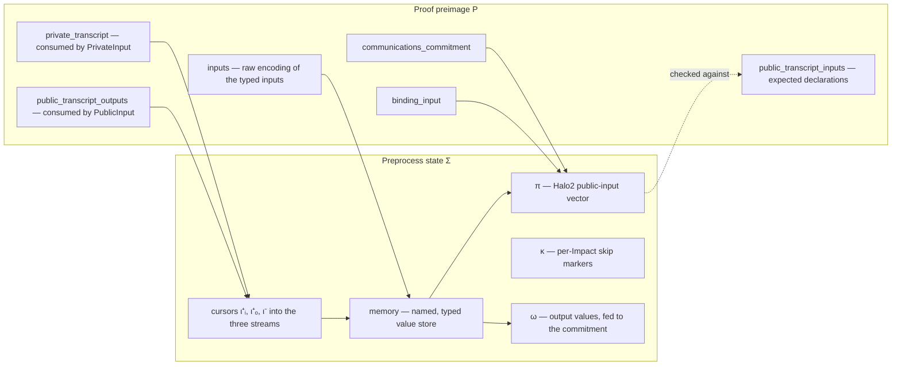
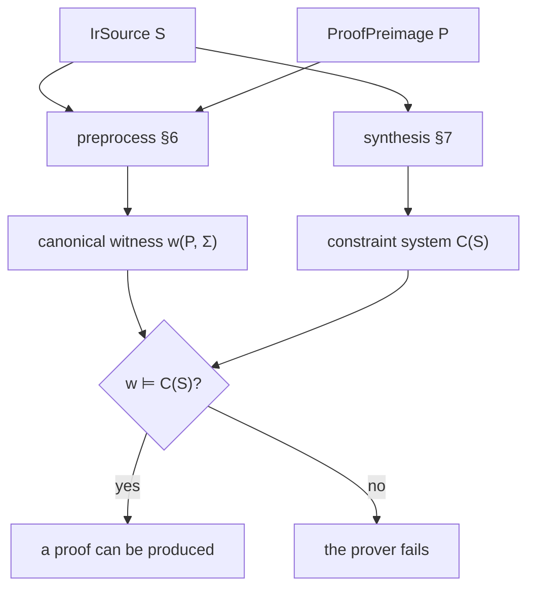

# ZKIR v3 — Language Specification

**Status:** Working draft.

**Versions covered:** ZKIR major version 3, minor version V0
(`IrMinorVersion::V0`). The major version is enforced by the JSON loader
(`IrSource::load` in `ir.rs`).

This document specifies ZKIR v3: its type system, the encoding of typed values
to raw field elements, the abstract syntax, the witness-population
(*preprocess*) semantics, the in-circuit (*circuit*) semantics, the
relationship between the two, and the properties an implementation must
satisfy. The Rust implementation is the ultimate source of truth for
behaviour; this document is pinned to the snapshot below.

**Mechanisation:** every property of §8 is machine-checked, in a companion Agda
formalisation of §3–§8 covering the full thirteen-type surface
([src/zkir-v3/](../src/zkir-v3/)): faithfulness in both directions, statement
soundness, uniqueness of extraction, and the decidability of the producer
obligations of §8.2 (which therefore come with runnable checkers). The
development typechecks under `--safe` with no `postulate`s; its trust base is
the single `Assumptions` record described in §8.6. Appendix D maps sections to
modules; the full result inventory is in
[src/zkir-v3/README.md](../src/zkir-v3/README.md).

---

## Source pinning

This spec is written against a single, pinned snapshot of the Rust
implementation:

| | |
|---|---|
| Repository | `midnightntwrk/midnight-zkir` (branch `zkir-v3`) |
| Commit | **`5b593d19a82a91f1fd47d0f8cb713807afd646fd`** (`5b593d1`) |
| Crate | `midnight-zkir`, `version = "3.0.0"` |
| Crate path | `zkir/` |

`zkir/`'s own source at this pin is confirmed byte-identical to this
spec's previous pin, `midnight-ledger`'s `92e8bdd3` (`zkir-v3/`, before
`zkir` was split out into its own repository) — so this re-pin changes
only the reference point and the crate path, not any type/instruction-
level content this spec describes.

**This pin predates
[PR #10, "Bring lost PRs from midnight-ledger"](https://github.com/midnightntwrk/midnight-zkir/pull/10)**
(merged 2026-08-28), which brought in a batch of instructions/types
authored earlier against `midnight-ledger` but never merged there before
`zkir` was extracted: `LoadConstant`, `And`/`Or`/`Xor` (and the new
`Bool` type they operate over), a new `Byte` type, a `Bytes32 →
Bytes(n)` generalization (with new `Nth`/`Concat`/`Slice` instructions
and a generalized `ReverseBytes`), `Sha512`, and stricter canonicity
checks in `decode`. None of that is covered by this spec or its Agda
mechanization yet.

`ir_types.rs` at this pin defines thirteen types, including the three
Edwards-form `Curve25519*` types. §2.2 and the rest of this document
describe the pin's full type surface, and the Agda mechanization covers
the same surface. Curve25519 is the one curve here whose identity *has*
affine coordinates, which is why its coordinate and encoding treatment
differs from the Weierstrass curves' (§4.1, §9).

### Files this spec is derived from (at the pinned commit)

| Rust file | Governs spec section(s) |
|---|---|
| `zkir/src/ir_types.rs` | §3 (types, values) |
| `zkir/src/ir_instructions/encode.rs` | §4 (encoding), parts of §6/§7 |
| `zkir/src/ir.rs` | §5 (syntax, `IrSource`, `Operand`, versioning, serialization) |
| `zkir/src/ir_vm.rs` | §6 (preprocess), §7 (circuit / `Relation`) |
| `zkir/src/ir_instructions/*.rs` | §6/§7 per-instruction type dispatch (the support matrix, Appendix B) |
| `zkir/src/main.rs` | §2.4 (compiler pipeline, *informative*) |

---

## Table of contents

1. [Introduction](#1-introduction)
2. [Overview](#2-overview)
3. [Types and values](#3-types-and-values)
4. [Encoding](#4-encoding)
5. [Syntax](#5-syntax)
6. [Preprocess semantics](#6-preprocess-semantics)
7. [Circuit semantics](#7-circuit-semantics)
8. [Properties](#8-properties)
9. [Limitations](#9-limitations)
10. [Appendix A — Glossary](#appendix-a--glossary)
11. [Appendix B — Type-support matrix](#appendix-b--type-support-matrix)
12. [Appendix C — Differences from v2](#appendix-c--differences-from-v2)
13. [Appendix D — Spec → mechanisation map](#appendix-d--spec--mechanisation-map)

---

## 1. Introduction

### 1.1 Conventions

- `Fr` denotes the BLS12-381 scalar field, also called the **native** field and
  the **base** field of Jubjub. `FR_BITS = 255`, `FR_BYTES_STORED = 31`. `0`
  and `1` denote the field's additive and multiplicative identities; we
  identify booleans with `{0, 1} ⊂ Fr`.
- "Memory" always means the named value store `memory : Identifier ⇀ IrValue`
  introduced in §2.3.
- An operand resolved to an immediate is always of type `Native` (§3.4).
- `xs ++ ys` is concatenation; `xs[k:]`, `xs[:k]` are slices.
- "UB" stands for *undefined behaviour* — a precondition the language assumes
  the producer of the circuit has discharged.
- Field/curve/hash primitives named here (Poseidon transient hash, SHA-256
  persistent hash, Keccak-256, hash-to-curve, the Pedersen-style
  `transient_commit`, the curve groups and their scalar/base fields, and the
  per-type encoders of §4) are part of the **trust base**: this document treats
  them abstractly, and §8.6 says exactly which of their properties the
  guarantees of §8 depend on.

### 1.2 What ZKIR is

ZKIR ("zero-knowledge intermediate representation") is the low-level circuit
description language that Midnight's Compact contract compiler emits and that
Midnight's Halo2/PLONK-based proof system consumes.

At a high level, each ZKIR program defines an **NP relation** `R(x, w)`. The
instance `x` and witness `w` are drawn from data flowing through a fixed set
of *side-effect channels* (transcripts, public-input vector, communications
commitment) — though some of that channel data is also incorporated at the
call-transaction level to describe how a circuit call interacts with circuits
in other contracts.

> **TODO:** Specify precisely how the data in each side-effect channel maps
> onto the ZK instance (`x`) and witness (`w`), and what is exposed at the
> call-transaction level versus consumed internally.

Like all ZK circuits, a ZKIR source has **two semantics that must agree**:

- as a **witness-generation function** (*preprocess*, §6) — given a *proof
  preimage* (inputs, transcripts, randomness), the circuit executes forward as
  a register machine to populate the typed value store and drive the
  side-effect channels. If execution completes without a constraint violation,
  the resulting store is the satisfying assignment handed to Halo2. The
  side-effect channels are part of *this* semantics: they are the mechanism by
  which instance and witness data flow into and out of the circuit at runtime.
- as a **constraint-system blueprint** (*circuit synthesis*, §7) — the same
  instructions are lowered to a Halo2 PLONKish constraint system. Here, only
  the **public-input vector** is visible as the external interface; transcript
  reads become unconstrained witness wires (which is why the backward
  direction of faithfulness is the non-trivial one — see §7.2 and §8.3).

The prover succeeds if and only if witness generation succeeds, i.e. iff
`R(x, w)` holds for the supplied `(x, w)`. That this *iff* holds is the
faithfulness property (§8) — the load-bearing property of the language, and
the one on which the downstream security guarantees rest.

ZKIR is deliberately minimal: the instruction set is a straight-line sequence
of 34 primitive operations over a store of typed, named, single-assignment
values (§3), with no structured control flow. This is what makes the
two-semantics correspondence tractable to formalise and verify.

### 1.3 What changed from v2 *(orientation; full table in Appendix C)*

v3 keeps v2's two-pass architecture but replaces v2's untyped, positional,
single field-element register file with a **typed value store over named
registers**:

- **Typed values.** Every value has an `IrType` (§3) drawn from a set of
  thirteen: the native field, a 32-byte type, and the point/scalar/base
  structures of four elliptic curves (Jubjub, Secp256k1, Secp256r1, and
  Curve25519). v2 was untyped — every value was a raw `Fr`.
- **Named registers.** Operands reference values by string `Identifier`
  (`%`-prefixed) rather than by numeric index into an append-only list.
- **Multiple curves.** Secp256k1, Secp256r1, and Curve25519 (foreign fields,
  emulated in-circuit) join Jubjub.
- **Explicit typed output signature.** `IrSource` carries an `outputs:
  [IrType]` signature, and a terminal `Output` instruction is type-checked
  against it. v2 had no typed output signature.
- **A first-class encoding layer (§4).** Because values are typed, the
  conversion between a value and its raw `Fr` representation — trivial in v2 —
  is now an explicit, security-relevant component used at every circuit
  boundary (inputs, transcripts, outputs, commitment).

### 1.4 Design philosophy

- **Typed, define-before-use.** Each value carries a type; each register
  (`Identifier`) is written before it is read. Type errors and unsupported
  type combinations are *runtime errors* of preprocess / synthesis (see the
  per-instruction support matrix, Appendix B), not a static type system in the
  IR itself.
- **No structured control flow.** The instruction stream is straight-line.
  Conditional behaviour is expressed by computing a boolean and threading it
  through `CondSelect`, guarded transcript reads, and guarded `Impact`
  declarations.
- **UB as unsatisfiability.** Instructions whose precondition implies undefined
  behaviour (UB) are not a separate failure mode at the language level — they
  merely make the resulting constraint system unsatisfiable on inputs that
  would have triggered them in preprocess. This is what makes the two
  semantics comparable in the first place.
- **Thin layer over `ZkStdLib`.** Each instruction corresponds, roughly, to one
  or a few chip calls in the `midnight-zk` standard library; the off-circuit
  and in-circuit behaviours are defined in matched
  `*_offcircuit` / `*_incircuit` pairs (`zkir/src/ir_instructions/`). Each
  chip call is in turn compiled to polynomial constraints by the Halo2
  backend; the soundness of those polynomial constraint encodings is part of
  the trust base (§8.6).

---

## 2. Overview

### 2.1 An `IrSource` at a glance

A ZKIR v3 circuit is a record (`ir.rs`, `IrSource`):

```
IrSource = {
  version                       : IrMinorVersion,
  inputs                        : [ TypedIdentifier ],
  outputs                       : [ IrType ],        -- positional output signature
  do_communications_commitment  : bool,
  instructions                  : [ Instruction ],
}

TypedIdentifier = { name : Identifier, type : IrType }
```

`inputs` declares the named, typed circuit inputs (decoded from the preimage's
raw `inputs` stream, §6.2). `outputs` declares the positional types the circuit
returns; the terminal `Output` instruction supplies one operand per declared
output type (§6.4). `do_communications_commitment` toggles the commitment sink
(§6.5).

The smallest non-trivial circuit — one native input, asserted to be `1`:

```json
{
  "version": { "major": 3, "minor": 0 },
  "inputs": [ { "name": "%x", "type": "Scalar<BLS12-381>" } ],
  "outputs": [],
  "do_communications_commitment": false,
  "instructions": [ { "op": "assert", "cond": "%x" } ]
}
```

The preimage must supply exactly one raw field element for `%x` (the encoded
width of `Native`, §4.1). With an empty public transcript, the binding input is
the only publicly bound value. A worked example exercising transcripts and
public-input declaration is in §6.8.

### 2.2 The type set

Thirteen types (`ir_types.rs`, `IrType`), each with a fixed raw-`Fr` encoding
width `encoded_len` (§4):

| `IrType` | JSON ("serde") name | `encoded_len` | meaning |
|---|---|---|---|
| `Native` | `Scalar<BLS12-381>` | 1 | native field element (also Jubjub base field) |
| `Bytes32` | `Bytes<32>` | 2 | 32 bytes |
| `JubjubPoint` | `Point<Jubjub>` | 2 | Jubjub curve point (affine `x`, `y`) |
| `JubjubScalar` | `Scalar<Jubjub>` | 1 | Jubjub scalar field element |
| `Secp256k1Point` | `Point<Secp256k1>` | 5 | Secp256k1 (`k256`) curve point ‡ |
| `Secp256k1Base` | `Base<Secp256k1>` | 2 | Secp256k1 base field element ‡ |
| `Secp256k1Scalar` | `Scalar<Secp256k1>` | 2 | Secp256k1 scalar field element ‡ |
| `Secp256r1Point` | `Point<Secp256r1>` | 5 | Secp256r1 (`p256`) curve point ‡ |
| `Secp256r1Base` | `Base<Secp256r1>` | 2 | Secp256r1 base field element ‡ |
| `Secp256r1Scalar` | `Scalar<Secp256r1>` | 2 | Secp256r1 scalar field element ‡ |
| `Curve25519Point` | `Point<Curve25519>` | 4 | Curve25519 curve point ‡ |
| `Curve25519Base` | `Base<Curve25519>` | 2 | Curve25519 base field element ‡ |
| `Curve25519Scalar` | `Scalar<Curve25519>` | 2 | Curve25519 scalar field element ‡ |

‡ The Secp256k1 and Secp256r1 triples are backed by the `k256` and `p256`
crates (`K256`/`P256` with their `Fp`/`Fq`); the Curve25519 triple by
`midnight_curves::curve25519` (`Curve25519Subgroup`, the `2²⁵⁵−19` base
field `Fp`, and `Scalar` re-exported from `curve25519_dalek`). Curve25519's
point encoding is 4 rather than 5 elements: being an Edwards curve, its
identity has affine coordinates, so no is-identity flag is needed (§4.1).
See §9 for the identity-encoding and decode-canonicity caveats.

### 2.3 Execution model

At runtime the prover holds a *preprocess state* `Σ` (`ir_vm.rs`,
`Preprocessed` plus interpreter-local cursors):

```
Σ = ⟨ memory  : Identifier ⇀ IrValue,   -- the named value store
      π       : Fr*,                     -- pis (Halo2 public-input vector)
      κ       : (Maybe ℕ)*,              -- pi_skips (per-Impact skip markers)
      ι⁺ᵢ     : ℕ,                       -- cursor over public_transcript_inputs
      ι⁺ₒ     : ℕ,                       -- cursor over public_transcript_outputs
      ι⁻      : ℕ,                       -- cursor over private_transcript
      ω       : IrValue* ⟩               -- outputs (fed to comm. commitment)
```

The proof preimage `P` supplies (`ProofPreimage`, used in `ir_vm.rs` and
`tests/common/mod.rs`):

```
P.inputs                    : Fr*    -- raw encoding of the typed circuit inputs
P.binding_input             : Fr     -- always π[0]
P.communications_commitment : Maybe (Fr × Fr)   -- (commitment, randomness)
P.public_transcript_inputs  : Fr*    -- values the circuit declares (via Impact)
P.public_transcript_outputs : Fr*    -- values the circuit consumes (PublicInput)
P.private_transcript        : Fr*    -- prover-private values (PrivateInput)
```

Each instruction is a transition over `Σ`. Execution may *fail* (an expected
outcome signalling "this preimage does not satisfy this circuit") or, for
malformed inputs, error.



The three streams are read left to right by the cursors; `π` is written by the
initialisation step and by `Impact`, and is the only part of `Σ` the verifier
sees. `ω` matters only when the communications commitment is enabled (§6.5).

### 2.4 The compiler pipeline *(informative)*

The `zkir` binary (`main.rs`) compiles a `.zkir` (JSON) or `.bzkir` (tagged
binary) source. `compile` / `compile-many` run `keygen` to emit a
prover/verifier key pair; `mock-compile` reports only the circuit cost model
(`k`, rows). At runtime the protocol layer supplies the `ProofPreimage`; the
prover runs `preprocess` then hands the witness to Halo2 (`IrSource::prove`),
producing `(Proof, pis, pi_skips)`; the verifier checks the proof against the
reconstructed public-input vector.

### 2.5 Instruction catalogue

The 34 instructions, by category:

| Category | Instructions |
|---|---|
| Arithmetic | `Add`, `Mul`, `Neg`, `Inv` |
| Boolean / comparison | `Not`, `TestEq`, `LessThan` |
| Copy & select | `Copy`, `CondSelect` |
| Constraints | `Assert`, `ConstrainEq`, `ConstrainToBoolean`, `ConstrainBits` |
| Bit/field manipulation | `DivModPowerOfTwo`, `ReconstituteField` |
| Encoding | `Encode` |
| Type conversion | `IntoCoordinates`, `FromCoordinates`, `IntoBytes32`, `FromBytes32`, `ReverseBytes`, `Bytes32IntoLowHigh`, `Bytes32FromLowHigh`, `JubjubScalarFromNative` |
| Elliptic curve | `EcMul`, `EcMulGenerator`, `HashToCurve` |
| Hashing | `TransientHash`, `PersistentHash`, `Keccak256` |
| Transcript I/O | `PublicInput`, `PrivateInput` |
| Public-input declaration | `Impact` |
| Terminator | `Output` |

The "Boolean / comparison" category is not a distinct type: booleans are
`Native` scalars constrained to `{0, 1}` by convention and, where required for
soundness, by explicit `ConstrainToBoolean` or `ConstrainBits` instructions
(§8.2). The per-instruction type-support matrix is **Appendix B**; the
preprocess reference is §6.3.

---

## 3. Types and values

This section corresponds to `ir_types.rs`.

### 3.1 `IrType`

The thirteen types of §2.2. `Native` is the native (BLS12-381 scalar) field
and the base field of Jubjub. Jubjub is a twisted Edwards curve embedded over
`Native`; Secp256k1 ("K256") and Secp256r1 ("P256") are Weierstrass curves
and Curve25519 a twisted Edwards curve, all three over *foreign* fields
emulated in-circuit via limb decompositions — which is why their encodings
are wide (Appendix B). Curve25519 is thus the one curve that is both foreign
and Edwards-form, and the one whose identity is a genuine affine point
rather than a flagged special case (§4.1, §9).

### 3.2 `IrValue` — off-circuit values

The off-circuit value domain (`IrValue`) carries actual data, one variant per
type:

```
IrValue ::= Native            Fr
          | Bytes32           [u8; 32]
          | JubjubPoint       JubjubSubgroup
          | JubjubScalar      JubjubFr
          | Secp256k1Point    k256::K256
          | Secp256k1Base     k256::Fp
          | Secp256k1Scalar   k256::Fq
          | Secp256r1Point    p256::P256
          | Secp256r1Base     p256::Fp
          | Secp256r1Scalar   p256::Fq
          | Curve25519Point   curve25519::Curve25519Subgroup
          | Curve25519Base    curve25519::Fp
          | Curve25519Scalar  curve25519::Scalar
```

`get_type : IrValue → IrType` reads off the variant. Each type has a `default`
value (used by guarded transcript reads, §6.4).

### 3.3 `CircuitValue` — in-circuit values

The in-circuit mirror (`CircuitValue`) is a placeholder for an `IrValue`: an
assigned circuit cell (or structured collection of cells) that carries data only
during proving. The variants correspond one-to-one with `IrValue`; `Bytes32` is
held as 32 assigned bytes, points and foreign-field elements as their assigned
representations. `get_type : CircuitValue → IrType` likewise reads the variant.

### 3.4 Operands and immediates

An operand (`ir.rs`, `Operand`) is either a register reference or an immediate:

```
Operand ::= Variable Identifier   -- a value previously bound in `memory`
          | Immediate Fr          -- a literal field element
```

An immediate **always resolves to a `Native` value** (`resolve_operand` in
`ir_vm.rs` returns `IrValue::Native(imm)`). There is no immediate form for any
other type; non-native constants are produced by instructions (e.g.
`FromBytes32`, `FromCoordinates`).

### 3.5 The output signature

`IrSource.outputs : [IrType]` is a positional signature. The terminal `Output`
instruction carries `vals : [Operand]`; preprocess and synthesis both check
that `|vals| = |outputs|` and that the runtime type of each resolved `vals[i]`
equals `outputs[i]` (§6.4, `I::Output`).

---

## 4. Encoding

This section corresponds to `ir_instructions/encode.rs`. The encoding is the
**wire format** that crosses every circuit boundary: the preimage's raw
`inputs`, the transcript streams, the declared outputs, and the commitment
preimage are all sequences of `Fr` obtained by encoding typed values.

### 4.1 `encode` / `decode`

`encode : IrValue → [Fr]` flattens a typed value into raw field elements;
`decode : [Fr] → IrType → IrValue` is the partial inverse. The width of
`encode v` is `encoded_len (get_type v)` (§2.2). The encodings:

| Type | `encode` (→ `[Fr]`, length) | notes |
|---|---|---|
| `Native` | `[x]` (1) | identity |
| `Bytes32` | `[low, high]` (2) | `low` = first 31 bytes as a field element; `high` = byte 31 |
| `JubjubPoint` | `[x, y]` (2) | affine coordinates |
| `JubjubScalar` | `[s]` (1) | canonical 252-bit scalar (see §9 on the `NUM_BITS` workaround) |
| `Secp256k1Point` ‡ | 5 elements | `k256`; `x`/`y` limbs |
| `Secp256k1Base` ‡ | 2 elements | `k256::Fp` limbs |
| `Secp256k1Scalar` ‡ | 2 elements | `k256::Fq` limbs |
| `Secp256r1Point` ‡ | 5 elements | `p256`; `x`/`y` limbs |
| `Secp256r1Base` ‡ | 2 elements | `p256::Fp` limbs |
| `Secp256r1Scalar` ‡ | 2 elements | `p256::Fq` limbs |
| `Curve25519Point` ‡ | 4 elements | `curve25519`; `x` limbs ++ `y` limbs, no identity flag |
| `Curve25519Base` ‡ | 2 elements | `curve25519::Fp` limbs |
| `Curve25519Scalar` ‡ | 2 elements | `curve25519::Scalar` limbs |

‡ `FromBytes32` on the Secp256k1/Secp256r1/Curve25519 types reduces via
`from_le_bytes_with_reduction` (mod order) and `IntoBytes32` emits
`to_bytes_le()` (confirmed identical for all three curves at the pinned
commit).

The Weierstrass point encodings are `x` limbs ++ `y` limbs ++ an
is-identity flag, because the Weierstrass identity has no affine
coordinates (§9). Curve25519, being an Edwards curve, needs no flag: its
identity is the affine point `(0, 1)`, so the encoding is just the two
coordinates and the width is 4 rather than 5.

The concrete field encodings of curve points and foreign-field elements are
delegated to `midnight-circuits` (`as_public_input` / `from_public_input`); the
spec treats them abstractly (trust base, §1.1). `decode` rejects raw
elements that are not a valid encoding of the target type (e.g. a `Bytes32`
`high` limb with set bytes beyond the first, or off-curve point
coordinates) — but note that `decode_offcircuit` in the pinned implementation
**panics**
(`assert_eq!`, `encode.rs:126-131`) rather than returning an error on
exactly the `Bytes32` case, and it is applied to prover-supplied `P.inputs`
and transcript data: a malformed preimage crashes `preprocess` instead of
failing it. The intended semantics is failure; the panic is an
implementation defect.

### 4.2 Where encoding is used

- **Inputs.** `preprocess` decodes `P.inputs` into the declared `inputs`,
  consuming `encoded_len(type)` raw elements per input, in declaration order,
  and requires `P.inputs` to be exactly consumed (§6.2).
- **Transcripts.** `PublicInput` / `PrivateInput` decode `encoded_len(val_t)`
  elements from the relevant transcript per active read (§6.4).
- **Commitment.** The communications commitment is taken over
  `P.inputs ++ encode(outputs)` (§6.5).

> **Note (hash input decoding).** `PersistentHash` / `Keccak256` do *not* use the
> `encode`/`decode` wire format above. They re-parse their `Native` inputs into a
> byte stream under the instruction's `Alignment` (`fab_decode_to_bytes` /
> `parse_field_repr` + `binary_repr` in `ir_vm.rs`) before digesting. Both
> semantics use the same byte stream, so the two agree by construction; the
> digest itself is part of the trust base (§8.6).

---

## 5. Syntax

This section corresponds to `ir.rs`.

### 5.1 Abstract syntax

`ℕ` denotes natural numbers (Rust `u32` for `bits` fields); `Fr` a BLS12-381
scalar; `Alignment` a *field-aligned binary* alignment descriptor, defined
externally in `base_crypto::fab` and treated abstractly here.

```
Identifier      ::= String                     -- '%'-prefixed in concrete form

IrMinorVersion  ::= V0

Operand         ::= Variable Identifier | Immediate Fr

TypedIdentifier ::= ⟨ name : Identifier, type : IrType ⟩

IrSource        ::= ⟨ version : IrMinorVersion,
                      inputs  : [ TypedIdentifier ],
                      outputs : [ IrType ],
                      do_communications_commitment : 𝔹,
                      instructions : [ Instruction ] ⟩

Instruction     ::=
  | Encode             input : Operand,  outputs : [ Identifier ]
  | Assert             cond : Operand
  | CondSelect         bit : Operand, a : Operand, b : Operand, output : Identifier
  | ConstrainBits      val : Operand, bits : ℕ
  | ConstrainEq        a : Operand, b : Operand
  | ConstrainToBoolean val : Operand
  | Copy               val : Operand, output : Identifier
  | Impact             guard : Operand, inputs : [ Operand ]
  | EcMul              a : Operand, scalar : Operand, output : Identifier
  | EcMulGenerator     scalar : Operand, output : Identifier
  | HashToCurve        inputs : [ Operand ], output : Identifier
  | IntoCoordinates    point : Operand, outputs : (Identifier, Identifier)
  | FromCoordinates    inputs : (Operand, Operand), output : Identifier
  | IntoBytes32        input : Operand, output : Identifier
  | FromBytes32        bytes : Operand, type : IrType, output : Identifier
  | ReverseBytes       bytes : Operand, output : Identifier
  | Bytes32IntoLowHigh bytes : Operand, outputs : (Identifier, Identifier)
  | Bytes32FromLowHigh inputs : (Operand, Operand), output : Identifier
  | DivModPowerOfTwo   val : Operand, bits : ℕ, outputs : [ Identifier ]
  | ReconstituteField  divisor : Operand, modulus : Operand, bits : ℕ, output : Identifier
  | TransientHash      inputs : [ Operand ], output : Identifier
  | PersistentHash     alignment : Alignment, inputs : [ Operand ], output : Identifier
  | Keccak256          alignment : Alignment, inputs : [ Operand ], output : Identifier
  | TestEq             a : Operand, b : Operand, output : Identifier
  | Add                a : Operand, b : Operand, output : Identifier
  | Mul                a : Operand, b : Operand, output : Identifier
  | Neg                a : Operand, output : Identifier
  | Inv                a : Operand, output : Identifier
  | Not                a : Operand, output : Identifier
  | LessThan           a : Operand, b : Operand, bits : ℕ, output : Identifier
  | JubjubScalarFromNative native : Operand, output : Identifier
  | PublicInput        guard : Maybe Operand, type : IrType, output : Identifier
  | PrivateInput       guard : Maybe Operand, type : IrType, output : Identifier
  | Output             vals : [ Operand ]
```

### 5.2 Concrete representations *(informative)*

- **JSON (`.zkir`).** `IrSource` serialises to an object; `version` uses
  `{ "major": 3, "minor": M }`, `M = 0`, normalised by the loader. Each
  instruction is tagged by an `op` field holding the snake-case variant name;
  field names match the abstract syntax (`val_t` is spelled `type`). An operand
  serialises to a **string**: a `Variable` is its `%`-prefixed name; an
  `Immediate` is lowercase little-endian hex `0x…` (optionally `-`-prefixed to
  negate, trailing zero bytes stripped). A bare string not starting with `0x`
  must start with `%` or deserialization fails.
- **Tagged binary (`.bzkir`).** A structural tag prefixes the data
  (`ir-source[v3-generic]` for the source, `ir-instruction[v3]` for
  instructions, etc.) so the deserialiser refuses the wrong shape.

### 5.3 Well-formedness

An `IrSource` is *well-formed* iff the following structural conditions hold.
They are necessary preconditions for §6 and §7; they are *not* sufficient for
preprocess success, which also depends on the preimage.

- **WF1 — input arity / encoding.** The total encoded width of `inputs`,
  `Σᵢ encoded_len(inputs[i].type)`, equals `|P.inputs|` at runtime (checked in
  `preprocess`).
- **WF2 — bit bounds.** Bit-count fields are bounded per-instruction:
  - `ConstrainBits { bits }`, `LessThan { bits }`: `bits < FR_BITS`. Preprocess
    rejects `bits ≥ FR_BITS` ("Excessive bit bound").
  - `DivModPowerOfTwo { bits }`, `ReconstituteField { bits }`:
    `bits ≤ FR_BYTES_STORED · 8` (`≤ 248`). Preprocess rejects beyond this.
- **WF3 — arities.** `Encode` requires `|outputs| = encoded_len(type of input)`;
  `DivModPowerOfTwo` requires exactly 2 outputs; `Output` requires
  `|vals| = |IrSource.outputs|`.  (`PersistentHash` / `Keccak256` bind a
  single `Bytes32` output, so they carry no arity side-condition.)
  (The pair-typed `IntoCoordinates`, `FromCoordinates`, `Bytes32IntoLowHigh`,
  `Bytes32FromLowHigh` fix their arity structurally.)
- **WF4 — define-before-use.** Every `Variable` operand names a register bound
  by an earlier instruction (or a declared input). Re-binding an existing name
  is checked for consistency at synthesis (`mem_insert` in `ir_vm.rs`) —
  except by `FromBytes32`, `ReverseBytes`, `Bytes32IntoLowHigh`, and
  `Bytes32FromLowHigh`, which bypass `mem_insert` with a raw
  `memory.insert` — so the prover-side check does not cover those bindings;
  the intended discipline is single assignment.
- **WF5 — `Impact` discipline.** Each `Impact` declares its own group of
  `|inputs|` public inputs and its own guard, so public-input coverage is
  structural rather than a separate obligation (§6.4, §7.2).

Operand type-compatibility (e.g. `Add` on two `Native`s) is **not** a
well-formedness condition in this sense — it is enforced dynamically and is the
content of the support matrix (Appendix B). A type mismatch is a runtime error
of both preprocess and synthesis.

---

## 6. Preprocess semantics

This section corresponds to `IrSource::preprocess` in `ir_vm.rs`: a forward
reference interpreter producing the witness, the public-input vector, and the
skip information.

### 6.1 State and notation

State `Σ` is as in §2.3. Helpers:

- `resolve(M, op)` — `M[id]` if `op = Variable id` (fails if unbound);
  `Native imm` if `op = Immediate imm`.
- `bool(op)` — resolve `op` to a `Native` value `v`; `false` if `v = 0`, `true`
  if `v = 1`, fail otherwise.
- `bits(op, n)` — the little-endian bit list of the (native) value of `op`; with
  bound `n`, fails unless the value fits in `n` bits.
- `eval-guard(M, g)` — `true` if `g = nothing`; `bool(g')` if `g = some g'`.
- `encode` / `decode` — §4.

### 6.2 Initialisation

Given source `S` and preimage `P`:

1. Decode inputs: walking `S.inputs` in order, consume `encoded_len(type)`
   elements of `P.inputs` per input and `decode` them, binding `name ↦ value`.
   Fail if `P.inputs` runs out or is not exactly consumed (WF1).
2. Seed `π = [P.binding_input]`. If `S.do_communications_commitment` is set,
   require `P.communications_commitment = some (c, _)` and append `c` to `π` (so
   the commitment is `π[1]`), failing if the preimage carries none. If the flag
   is clear, `π` stays `[P.binding_input]` and `P.communications_commitment` is
   ignored entirely — which is what the uniqueness proviso of §8.4 turns on.
3. All cursors start at 0; `κ = []`, `ω = []`.

### 6.3 Instruction reference (tabular)

One line per instruction. "Out" gives the registers bound. Type support and
error conditions are in Appendix B; here `⊕`, `⊗` etc. denote the *type-correct*
operation selected by the operand types.

| Instruction | Preconditions (beyond type support) | Effect / Out | Side effects |
|---|---|---|---|
| `Encode(in, outs)` | `\|outs\| = encoded_len(type in)` | `outs ↦ encode(in)` | — |
| `Assert(c)` | `bool(c) = true` | — | — |
| `CondSelect(b,a,c,o)` | `bool(b)` defined; `type a = type c` | `o ↦ a` if `bool(b)` else `c` | — |
| `ConstrainBits(v,n)` | value of `v` `< 2ⁿ` | — | — |
| `ConstrainEq(a,b)` | `a = b` | — | — |
| `ConstrainToBoolean(v)` | value of `v` `∈ {0,1}` | — | — |
| `Copy(v,o)` | — | `o ↦ v` | — |
| `Impact(g, ins)` | each `in` is `Native` | — | push each `in` to `π`; see §6.4 |
| `EcMul(a,s,o)` | — | `o ↦ s ·_curve a` | — |
| `EcMulGenerator(s,o)` | — | `o ↦ s ·_curve G` | — |
| `HashToCurve(I,o)` | each `I` is `Native` | `o ↦ H2C(I)` : `JubjubPoint` | — |
| `IntoCoordinates(p,(x,y))` | `p` not the Weierstrass identity | `x,y ↦ coords(p)` | — |
| `FromCoordinates((x,y),o)` | `(x,y)` on the curve (and not identity, Weierstrass) | `o ↦ point(x,y)` | — |
| `IntoBytes32(in,o)` | — | `o ↦ bytes(in)` : `Bytes32` | — |
| `FromBytes32(b,t,o)` | — | `o ↦ value_t(b)` (reduces mod char) | — |
| `ReverseBytes(b,o)` | `b` is `Bytes32` | `o ↦ reverse(b)` : `Bytes32` | — |
| `Bytes32IntoLowHigh(b,(lo,hi))` | — | `lo ↦` first 31 bytes; `hi ↦` byte 31 | — |
| `Bytes32FromLowHigh((lo,hi),o)` | `lo < 2²⁴⁸`, `hi < 256` | `o ↦` 32 bytes | — |
| `DivModPowerOfTwo(v,n,[q,r])` | `n ≤ 248` | `q ↦ v ≫ n`, `r ↦ v mod 2ⁿ` | — |
| `ReconstituteField(d,m,n,o)` | `n ≤ 248`, `m < 2ⁿ`, `d < 2^{FR_BITS−n}`, `d·2ⁿ+m < \|Fr\|` | `o ↦ d·2ⁿ + m` | — |
| `TransientHash(I,o)` | each `I` is `Native` | `o ↦ H_T(I)` | — |
| `PersistentHash(α,I,o)` | each `I` is `Native`; `I` matches `α` | `o ↦ SHA-256(binary_repr(α, I))` : `Bytes32` | — |
| `Keccak256(α,I,o)` | each `I` is `Native`; `I` matches `α` | `o ↦ Keccak-256(binary_repr(α, I))` : `Bytes32` | — |
| `TestEq(a,b,o)` | — | `o ↦ χ(a = b)` : `Native` | — |
| `Add(a,b,o)` | — | `o ↦ a ⊕ b` | — |
| `Mul(a,b,o)` | — | `o ↦ a ⊗ b` | — |
| `Neg(a,o)` | — | `o ↦ ⊖a` | — |
| `Inv(a,o)` | value of `a` `≠ 0` | `o ↦ a⁻¹` | — |
| `Not(a,o)` | `bool(a)` defined | `o ↦ χ(¬bool(a))` : `Native` | — |
| `LessThan(a,b,n,o)` | `a < 2ⁿ`, `b < 2ⁿ` | `o ↦ χ(a < b)` : `Native` | — |
| `JubjubScalarFromNative(x,o)` | — | `o ↦ x mod \|Jubjub scalar\|` : `JubjubScalar` | — |
| `PublicInput(g,t,o)` | — | `o ↦` next `encoded_len(t)` of `τ⁺ₒ` if `eval-guard`, else `default(t)` | advances `ι⁺ₒ` if active |
| `PrivateInput(g,t,o)` | — | `o ↦` next of `τ⁻` if `eval-guard`, else `default(t)` | advances `ι⁻` if active |
| `Output(vals)` | `\|vals\| = \|S.outputs\|`, `type vals[i] = S.outputs[i]` | `ω ↦ vals` | — |

### 6.4 Selected rules in detail

**`Impact(guard, inputs)`** — declares a guarded group of public inputs.
Off-circuit, with `n = |inputs|`:

- if `bool(guard) = false` ("skipped"): push `n` zeros to `π`, push `some n` to
  `κ`, and leave the public-transcript-inputs cursor `ι⁺` unmoved. The zeros
  mirror the in-circuit `select(guard, x, 0)`, so a guarded-off impact
  contributes zeroed public inputs rather than the resolved values;
- if `bool(guard) = true` ("active"): resolve each `in` (must be `Native`), push
  its value to `π`, advance `ι⁺` by `n`, push `none` to `κ`, and check that the
  `n` just-pushed entries of `π` equal
  `P.public_transcript_inputs[start : start+n]` (a prover-side self-check);
  fail on mismatch.

In-circuit (§7.2), `Impact` instead pushes, for each input, `select(guard, x,
0)` — `n` public inputs that are the values when the guard holds and zeros
otherwise. The off-circuit zeroed-and-skipped branch is exactly what keeps the
two public-input vectors aligned.

**`PublicInput` / `PrivateInput`.** Off-circuit, the guard chooses between
consuming the next `encoded_len(type)` elements of the relevant transcript
(decoding to `type`) and yielding `default(type)`. **In-circuit the guard does
not participate**: the value is witnessed freely (assigned from the preprocessed
`memory`), constrained only to inhabit `type`. The two instructions differ only
in *which* transcript preprocess consumes from.

**`Output(vals)`.** The terminator by convention, not enforcement. Checks
arity and per-position runtime types against `S.outputs`, then **appends**
the resolved values to `ω` (`outputs.push` in both passes). Nothing requires
an `Output` to be present or unique: a source with no `Output` leaves `ω`
empty even for a nonempty signature (TC1/TC2 do not compare `ω` against the
signature), and a second `Output` appends `|S.outputs|` further values, all
of which feed the commitment. The value list `ω` is what feeds the
commitment.

### 6.5 Acceptance

A run accepts iff, after executing every instruction from `init(S, P)`, the
terminal side conditions hold:

- **TC1 — transcripts consumed.** The three cursors equal the lengths of
  `P.public_transcript_inputs`, `P.public_transcript_outputs`, and
  `P.private_transcript` respectively (all fully consumed).
- **TC2 — communications commitment.** If `S.do_communications_commitment` is
  false, no condition. Otherwise, with `(c, r) = P.communications_commitment`,
  require `c = transient_commit(P.inputs ++ encode(ω), r)`, where `encode(ω)`
  flattens every output value (§4).

The resulting `Preprocessed { memory, pis, pi_skips, binding_input, comm_comm }`
is the *preprocessed witness*.

### 6.6 Failure modes

`preprocess` is partial; a `Nothing`/error means "this preimage does
not satisfy this circuit". Categories: (a) **expected failures** — a premise
reflecting a circuit constraint or transcript-conformance requirement fails
(`Assert`, `ConstrainEq`, bit/overflow bounds, the active-`Impact` match, TC1,
TC2, input arity); (b) **malformed preimage** — wrong-length `inputs`, missing
commitment when required, truncated transcripts; (c) **type errors** — an
operand combination outside the support matrix (Appendix B), or an `Output`
position whose runtime type disagrees with the signature; (d) **UB** — premises
the in-circuit lowering does not enforce (the boolean operand of `Assert` —
the lowering checks only `≠ 0`; the ignored transcript-read guards;
`ReconstituteField` no-overflow; the exact `LessThan` bounds), the
load-bearing concern of §8. The last column of the §7.2 table enumerates them;
obligation O4 (§8.2) is exactly their conjunction. (`CondSelect`/`Not`/`Impact`
guards are *not* in this class: their `AssignedBit` conversion does constrain
booleanity in-circuit, §7.2.)

### 6.7 Determinism

For fixed `S` and `P`, the preprocessed witness — if it exists — is unique: each
rule has a deterministic conclusion given its premises.

### 6.8 Worked example: knowledge of a hash preimage with nullifier emission

A circuit exercising private and public transcript reads, an equality
constraint, a public-input declaration, and the typed output signature.
Informally it proves: *I know `(x, r)` with `H_T(x, r) = h`, and I publicly
declare the derived nullifier `n = H_T(x)`.*

**Source.**

```
version = V0
inputs  = []
outputs = [ Native ]
do_communications_commitment = false

instructions:
  0. private_input   guard = —, type = Native, output = %x    -- read x
  1. private_input   guard = —, type = Native, output = %r    -- read r
  2. transient_hash  inputs = [%x, %r],        output = %hc   -- H_T(x, r)
  3. public_input    guard = —, type = Native, output = %h    -- read h
  4. constrain_eq    a = %hc, b = %h                          -- H_T(x, r) = h
  5. transient_hash  inputs = [%x],            output = %n    -- n = H_T(x)
  6. impact          guard = 0x1, inputs = [%n]               -- declare n
  7. output          vals = [%n]
```

The `Impact` guard is the immediate `0x1`, which resolves to `Native 1` (§3.4)
and so is active; a real producer would thread a computed boolean here.

**Preimage.** Let `h = H_T(x, r)` and `n = H_T(x)`. The verifier holds the
binding input `b` and, from the public transcript, `n`.

```
P.inputs                    = []
P.binding_input             = b
P.communications_commitment = none
P.public_transcript_inputs  = [n]        -- what the circuit declares
P.public_transcript_outputs = [h]        -- what the circuit consumes
P.private_transcript        = [x, r]
```

**Run.** Initialisation binds no inputs and seeds `π = [b]`; the commitment
flag is off, so nothing is appended (§6.2). Then:

| Step | Binds | `π` | Cursor moved |
|---|---|---|---|
| 0 | `%x ↦ x` | `[b]` | `ι⁻ = 1` |
| 1 | `%r ↦ r` | `[b]` | `ι⁻ = 2` |
| 2 | `%hc ↦ H_T(x, r)` | `[b]` | — |
| 3 | `%h ↦ h` | `[b]` | `ι⁺ₒ = 1` |
| 4 | — (premise `H_T(x, r) = h` holds) | `[b]` | — |
| 5 | `%n ↦ H_T(x)` | `[b]` | — |
| 6 | — | `[b, n]` | `ι⁺ᵢ = 1`, `κ = [none]` |
| 7 | — | `[b, n]` | `ω = [n]` |

Step 6 is an active `Impact`: it resolves `%n`, pushes it to `π`, and checks the
pushed entry against `P.public_transcript_inputs[0:1] = [n]` (§6.4). At the end
all three cursors are exhausted, so TC1 holds; TC2 is vacuous with the flag off,
and `ω` is therefore unused. The run accepts, with public-input vector
`π = [b, n]` and skip markers `κ = [none]`.

**What the circuit constrains.** Reading off §7.2, `C(S)` is:

```
poseidon %hc [%x, %r]          -- from instruction 2
eq %hc %h                      -- from instruction 4
poseidon %n [%x]               -- from instruction 5
⟦0x1⟧ ∈ {0,1}                  -- from instruction 6, the guard bit
π[1] = select(⟦0x1⟧, ⟦%n⟧, 0)  -- from instruction 6
π[0] free                      -- the binding input
```

Instructions 0, 1, 3 and 7 emit **nothing**. This is the point worth taking
from the example: no constraint ties `%x`, `%r` or `%h` to any transcript — the
transcript is not an input to the circuit (§7.2). What the circuit enforces is
only the *relation* between those cells: that `%hc` is the hash of `%x` and
`%r`, that it equals `%h`, and that the declared `π[1]` is the hash of `%x`.
The binding to actual transcript data happens off-circuit, through TC1 and the
active-`Impact` check, and at the protocol level through the verifier
rebuilding `π`. That is why recovering a run from a satisfying witness (§8.4)
has to read the transcript values back off the witness, and why obligation O4
(§8.2) asks the transcript cells to inhabit their declared type.

The source discharges the producer obligations of §8.2: the five bound names
are distinct (O1); every operand has the type its instruction expects and the
`Output` operand matches the `[Native]` signature (O2); no instruction carries a
bit count (O3, vacuous). By the non-vacuity of O4 (§8.4), the canonical witness
of the run above satisfies O4.

---

## 7. Circuit semantics

This section corresponds to `impl Relation for IrSource` in `ir_vm.rs`: the
synthesis of a Halo2/PLONKish constraint system over `CircuitValue`s, whose
public input is the `pis` vector.

### 7.0 The constraint system a source denotes

A source `S` denotes a PLONKish constraint system `C(S)` over a set of circuit
cells, together with a distinguished sequence of those cells — the public-input
vector `π` — which is its entire external interface. A *witness* assigns a value
to each cell; it **satisfies** `C(S)` when every constraint holds of it. Proving
`S` means exhibiting a witness that satisfies `C(S)` and whose `π` is the one
the verifier reconstructs; §8 characterises those witnesses.

**ZKIR defines no gates of its own.** Every instruction's in-circuit behaviour
is one or more calls into the `midnight-zk-stdlib` `ZkStdLib` facade (over
`midnight-circuits`); the PLONKish gates, lookup arguments, and cell layout
live in those libraries, not in the zkir crate. `C(S)` is the union of the
constraints those chip calls emit, and *only* that union: there is no
ZKIR-level gate and no global invariant beyond what the chips impose.

An instruction's in-circuit meaning is therefore fixed by two things: the
**relation** its chip establishes between the cells it reads and the cells it
binds, and which of its preconditions that chip **enforces** rather than
**assumes**. §7.2 gives both per instruction; the rest of this subsection says
what they range over.

**How instructions are arithmetized** *(informative)*. The relation is what
matters semantically, but the size and shape of the constraints realizing it
vary by orders of magnitude across the instruction set:

| Chip fragment | Realized as |
|---|---|
| native arith / bool / `select` / `is_equal` | a single `q_arith` gate + copy constraints |
| range / decomposition (`assigned_to_le_bytes`, `lower_than`, `ConstrainBits`) | lookup arguments (`Pow2RangeChip` tables, byte-range lookups) |
| **foreign field** (the Secp256k1 / Secp256r1 / Curve25519 base and scalar arith) | 4–5 limbs; CRT reduction with auxiliary moduli, nondeterministic quotient/remainder witness hints, per-limb range lookups, normalization gates; ≈5–10× native per op |
| curves (Jubjub and Curve25519 Edwards addition; Secp256k1/Secp256r1 complete-add, with GLV on Secp256k1 only; windowed MSM) | the in-circuit group law |
| hashes (Poseidon, SHA-256, Keccak-256, hash-to-curve) | full permutation/compression circuits + lookup tables |

**Enforced versus assumed preconditions.** A chip that *enforces* a
precondition makes `C(S)` unsatisfiable when it is violated, so the off-circuit
premise (§6) and the in-circuit constraint coincide. A chip that *assumes* one
emits nothing for it: a witness violating the premise can still satisfy `C(S)`.
Every assumed precondition is thus a point where the circuit is weaker than the
preprocess semantics — the undefined behaviour of §6.6(d) — and the producer
must establish it by other means (§8.2). The assumptions the deployed lowering
relies on:

- `select` / `and` / `not` / `cond_*` **assume** the selector bit is in
  `{0,1}`. ZKIR mostly does not depend on that assumption: wherever it converts
  a native cell to an `AssignedBit` first (`ConstrainToBoolean`, `Not`, the
  `CondSelect` bit, the `Impact` guard) booleanity *is* constrained. `Assert`
  is the case where it is not (§7.2).
- `inv` / `div` **assume** a non-zero argument. This opens no gap: the emitted
  constraints are unsatisfiable at zero, exactly where preprocess fails.
- `assigned_from_le_bytes` / `assigned_from_le_bits` **assume** their inputs are
  byte-/bit-ranged, so they must be paired with an enforcing decomposition —
  relevant to `ReconstituteField` and `DivModPowerOfTwo`.
- `assigned_to_le_bits` takes an `enforce_canonical` flag controlling whether
  the decomposition is pinned to the canonical representative.
  `DivModPowerOfTwo` passes it **unconditionally** (`ir_vm.rs:1013`), so
  canonicity is enforced on every input; `ConstrainBits` passes the conditional
  `bits ≥ FR_BITS`, a bound preprocess rejects anyway (WF2).

**Perimeter.** Because every instruction is a chip call, the guarantees of §8
are guarantees about ZKIR's *orchestration*: the right chips, wired to the
right cells, with the right values reaching `π`, and agreement between a
source's two semantics. Errors of that kind — a missing assertion, a
mis-encoded public input, an off-/in-circuit asymmetry such as
`CondSelect`/`Bytes32` (§7.2) — are in scope. A chip that does not implement
its documented contract is not: such a failure is invisible at the ZKIR level
and must be excluded by verification of `midnight-circuits` itself.

### 7.1 Two semantics, one source



Synthesis takes `S` alone — the preimage supplies witness values, never
constraints — so `C(S)` is fixed before any prover runs. That the two readings
of `S` agree is the faithfulness property P5 (§8.3): the diagram's `yes` branch
is taken for exactly those preimages preprocess accepts.

Synthesis walks the same instruction list, maintaining an in-circuit `memory :
Identifier ⇀ CircuitValue`. Inputs are assigned per type (`assign_incircuit`);
each instruction emits the constraints of its `*_incircuit` definition and binds
its outputs. `mem_insert` additionally asserts, when witness values are known,
that re-binding a name agrees with the preprocessed value (a prover-side
consistency check, not a circuit constraint).

The public-input vector is built in lock-step: `π[0]` is the binding input;
`π[1]` is the communications commitment if enabled; `Impact` appends its guarded
inputs. At the end, every entry of `π` is constrained as a public input.

**The canonical witness of a run.** A successful preprocess run determines an
assignment to every cell of `C(S)`: the cell bound to an identifier takes that
identifier's value in the run's `memory`, the public-input cells take the run's
`π`, and the commitment-randomness cell takes the second component of
`P.communications_commitment`. Write `w(P, Σ)` for that assignment — it is the
witness the prover hands to Halo2. Section 8 relates these canonical witnesses
to the satisfying assignments of `C(S)` at large.

### 7.2 Constraint-emission contracts (per instruction)

Each instruction's in-circuit contract is the `*_incircuit` function selected by
operand type (Appendix B). The table gives it for every instruction: the
relation the emitted constraints impose on the witness, and the off-circuit
premises (§6.3) they leave **unenforced**. The last column is the undefined
behaviour of §6.6(d); its `O3`/`O4` tags name the obligation of §8.2 that
discharges the entry. Write `⟦op⟧` for the value operand `op` resolves to in
the witness, and `χ(φ)` for the `Native` value `1` if `φ` and `0` otherwise;
`o` names the cell the instruction binds.

| Instruction | Relation constrained | Left unenforced |
|---|---|---|
| `Encode(in, outs)` | `outs` hold the raw elements of `encode ⟦in⟧` (§4) | — |
| `Assert(c)` | `⟦c⟧ ≠ 0` | `⟦c⟧ = 1` (O4) |
| `CondSelect(b,a,c,o)` | `⟦b⟧ ∈ {0,1}` and `o = ⟦a⟧` if `⟦b⟧ = 1`, else `⟦c⟧` | — |
| `ConstrainBits(v,n)` | `⟦v⟧ < 2ⁿ` | `n < FR_BITS` (O3) |
| `ConstrainEq(a,b)` | `⟦a⟧ = ⟦b⟧` | — |
| `ConstrainToBoolean(v)` | `⟦v⟧ ∈ {0,1}` | — |
| `Copy(v,o)` | `o = ⟦v⟧` | — |
| `Impact(g, ins)` | for each `ins[i]`: `⟦g⟧ ∈ {0,1}` and `π[start+i] = select(⟦g⟧, ⟦ins[i]⟧, 0)` | guard booleanity when `ins` is empty (nothing is emitted at all) |
| `EcMul(a,s,o)` | `o = ⟦s⟧ · ⟦a⟧` on the operands' curve | — |
| `EcMulGenerator(s,o)` | `o = ⟦s⟧ · G` for that curve's generator | — |
| `HashToCurve(I,o)` | `o = H2C(⟦I⟧)` | — |
| `IntoCoordinates(p,(x,y))` | `(x,y)` are the affine coordinates of `⟦p⟧`; unsatisfiable at the Weierstrass identity, with no such condition on the Edwards curves (§9) | — |
| `FromCoordinates((x,y),o)` | `o` is the point with coordinates `(⟦x⟧,⟦y⟧)`; unsatisfiable off-curve, and on the Edwards curves outside the prime-order subgroup (§9) | — |
| `IntoBytes32(in,o)` | `o` holds the little-endian bytes of `⟦in⟧` | — |
| `FromBytes32(b,t,o)` | `o` is `⟦b⟧` read as a `t`; on the foreign fields non-canonical bytes reduce mod the order | agreement with the off-circuit reduction on non-canonical bytes (§9) |
| `ReverseBytes(b,o)` | `o` is `⟦b⟧` byte-reversed (a permutation of the assigned bytes; no arithmetic constraint) | — |
| `Bytes32IntoLowHigh(b,(lo,hi))` | `(lo,hi)` is the low/high split of `⟦b⟧` | — |
| `Bytes32FromLowHigh((lo,hi),o)` | `⟦lo⟧ < 2²⁴⁸`, `⟦hi⟧ < 256`, and `o` is the reassembled `Bytes32` | — |
| `DivModPowerOfTwo(v,n,[q,r])` | `q = ⟦v⟧ ≫ n` and `r = ⟦v⟧ mod 2ⁿ`, via the canonical decomposition (`enforce_canonical`, §7.0) | `\|outputs\| = 2` — other arities emit nothing (O4); `n ≤ 248` (O3) |
| `ReconstituteField(d,m,n,o)` | `⟦d⟧ < 2^{FR_BITS−n}`, `⟦m⟧ < 2ⁿ`, `o = 2ⁿ·⟦d⟧ + ⟦m⟧` | no field overflow, `2ⁿ·⟦d⟧+⟦m⟧ < \|Fr\|` (O4); `n ≤ 248` (O3) |
| `TransientHash(I,o)` | `o = Poseidon(⟦I⟧)` | — |
| `PersistentHash(α,I,o)` | `o` is the SHA-256 digest of `⟦I⟧` under `α` | — |
| `Keccak256(α,I,o)` | `o` is the Keccak-256 digest of `⟦I⟧` under `α` | — |
| `TestEq(a,b,o)` | `o = χ(⟦a⟧ = ⟦b⟧)` | — |
| `Add(a,b,o)` | `o = ⟦a⟧ ⊕ ⟦b⟧` at the operands' type | — |
| `Mul(a,b,o)` | `o = ⟦a⟧ ⊗ ⟦b⟧` | — |
| `Neg(a,o)` | `o = ⊖⟦a⟧` | — |
| `Inv(a,o)` | `o = ⟦a⟧⁻¹`; unsatisfiable at `⟦a⟧ = 0` | — |
| `Not(a,o)` | `⟦a⟧ ∈ {0,1}` and `o = χ(⟦a⟧ = 0)` | — |
| `LessThan(a,b,n,o)` | `⟦a⟧, ⟦b⟧ < 2^{e}` where `e = max(n + n mod 2, 4)`, and `o = χ(⟦a⟧ < ⟦b⟧)` | the exact bound `⟦a⟧,⟦b⟧ < 2ⁿ` (O4); `n < FR_BITS` (O3) |
| `JubjubScalarFromNative(x,o)` | `o` is `⟦x⟧` carried into the Jubjub scalar field | — |
| `PublicInput(g,t,o)` | none: `o` is a free witness cell inhabiting `t` | the guard, the transcript value, and the encoding round-trip (O4) |
| `PrivateInput(g,t,o)` | none, as `PublicInput` | as `PublicInput` (O4) |
| `Output(vals)` | none directly; `vals` feed the commitment (§7.4) | arity and types against `S.outputs` |

Beyond the per-instruction constraints, `π[0]` is a free cell holding the
binding input and, when the flag is set, `π[1]` is constrained to the
communications commitment (§7.4).

Four entries deserve more than a table cell:

- **`Assert`** is the one place where a chip's booleanity assumption bites
  (§7.0): it emits `⟦c⟧ ≠ 0` where preprocess demands `⟦c⟧ = 1`. Elsewhere —
  `ConstrainToBoolean`, `Not`, the `CondSelect` bit, the `Impact` guard — the
  operand is converted to an `AssignedBit` first, which *does* constrain it to
  `{0,1}`.
- **`Impact`** enforces the zeroing of a skipped group in-circuit: a guarded-off
  group contributes `n` zeros to `π`, which is exactly what keeps the two
  public-input vectors aligned (§6.4).
- **`PublicInput` / `PrivateInput`** are the only instructions with no
  constraint at all. The guard does not participate in-circuit, and nothing ties
  the cell to any transcript — the transcript is not an input to the circuit.
  This is why recovering a run from a witness needs the extra data of §8.3.
- **`PersistentHash` / `Keccak256`** digest a byte stream obtained by decoding
  the inputs under the alignment (`fab_decode_to_bytes`), using the
  `std.sha2_256` / `std.keccak_256` chip; off-circuit digests the same
  field-aligned `binary_repr` (§4.2).

Two type-support asymmetries make an instruction accepted off-circuit but not
in-circuit: `CondSelect` has no in-circuit `Bytes32` arm, and neither
`CondSelect` nor `ConstrainEq` has a `JubjubScalar` arm (Appendix B, §7.5, §9).

### 7.3 Public-input layout and chip selection

`π = [binding_input] (++ [comm_commitment])? ++ (Impact groups…)`. The
communications commitment, when enabled, is constrained in-circuit to equal
`poseidon(rand :: encode(inputs) :: encode(outputs))` and asserted equal to
`π[1]` (§7.4). `used_chips` selects which `ZkStdLib` chips to instantiate based
on the types and instructions it inspects (Jubjub, Poseidon, SHA-256,
Keccak-256, Secp256k1, Secp256r1, Curve25519, range columns); see §7.5(c).

### 7.4 Communications commitment

When `do_communications_commitment`, synthesis recomputes the commitment
in-circuit as a Poseidon hash over `randomness`, then the encoded inputs, then
the encoded outputs, and asserts it equals the second public input. Off-circuit
the same relationship is checked against `transient_commit` (§6.5). The two
hash families (`transient_commit` vs in-circuit `poseidon`) are assumed to agree
as part of the trust base. Note the operands are not literally the same on
the input side: off-circuit hashes the **raw** `P.inputs` stream, while
in-circuit re-encodes the **current memory value** of each declared input
name after the instruction loop. The two coincide exactly when the per-type
encodings round-trip (§8.6) *and* no instruction rebinds an input name — the
latter being part of the single-assignment obligation of §8.2.

### 7.5 Determinism (and partiality) of synthesis

Synthesis is a deterministic function of `S` (independent of the preimage,
which only supplies witness values); the constraint system depends only on the
source. It is however **partial** in the Rust implementation: synthesis errors
on (a) a
`CondSelect` over `Bytes32` or `JubjubScalar`, or a `ConstrainEq` over
`JubjubScalar` — the in-circuit dispatch has no such arm (§7.2/§9);
(b) a `DivModPowerOfTwo` with `|outputs| ≠ 2`; and (c) a circuit
that reaches a curve/hash chip only through an instruction `used_chips` does
not inspect — the chip gating looks at declared `inputs` and the transcript
reads' `val_t` only, so e.g. a circuit whose sole Jubjub contact is
`FromCoordinates`, `FromBytes32`, `JubjubScalarFromNative`, or
`EcMulGenerator` fails at synthesis for want of the chip, and likewise a
circuit whose sole Secp256r1 or Curve25519 contact is `FromCoordinates` or
`FromBytes32`. Sources in these three classes have no circuit denotation, and
the properties of §8 say nothing about them.

---

## 8. Properties

This section states the properties that relate a source's two semantics — the
preprocess semantics of §6 and the constraint system of §7 — and that an
implementation must satisfy. Every statement is *modulo* the trust base (§8.6):
the chip contracts of §7.0 and the abstract primitives of §1.1.

Throughout, `S` is a source and `P` a preimage; `preprocess(S, P) = Σ` means
the run of §6 succeeds with final state `Σ`; `C(S)` is the constraint system
of §7.0; `w(P, Σ)` is the canonical witness of the run (§7.1); and `w ⊨ C(S)`
means the assignment `w` satisfies every constraint of `C(S)`.

We distinguish three levels. **Operational** properties (§8.1) are facts about
the preprocess semantics alone, provable by induction over the instruction
list. **Circuit-level** properties (§8.3, §8.4) relate preprocess to the
constraint system, and hold only for sources discharging the producer
obligations of §8.2; the faithfulness bridge P5 is the load-bearing one.
**Protocol-level** properties (§8.5) are the guarantees a caller of the proof
system actually wants; they are stated as obligations that reduce to P5 and to
the corresponding Halo2 properties.

Each subsection ends with its mechanisation status; the Agda names there are
pointers into [src/zkir-v3/](../src/zkir-v3/), whose README carries the full
result inventory.

### 8.1 Operational properties

**P1 — Transcript consumption.** If `preprocess(S, P) = Σ`, then all three
streams are exhausted: `Σ.ι⁺ᵢ = |P.public_transcript_inputs|`, and the
public-transcript-output and private-transcript cursors have reached the ends
of their streams. *Proof.* Acceptance condition TC1 (§6.5). ∎

**P2 — Store and public-input monotonicity.** Along any run, bindings are never
removed or overwritten and `π` is only extended: if `Σ` reaches `Σ'`, then every
binding of `Σ.memory` is present with the same value in `Σ'.memory`, and `Σ.π`
is a prefix of `Σ'.π`. *Proof.* Induction over the instruction list; each rule
either inserts fresh names or appends to `π`. Requires O1 — without it an
instruction may rebind a name. ∎

**P3 — Determinism.** `preprocess(S, P)` is a partial function of `(S, P)`
(§6.7). *Proof.* Each rule has a unique conclusion given its premises. ∎

**P4 — Well-formedness preservation.** Under O1, at every intermediate state the
domain of `memory` is exactly the declared input names together with the outputs
of the instructions executed so far. Consequently every `Variable` operand of
the next instruction is either already bound or the transition fails; the
define-before-use condition WF4 (§5.3) is an invariant, not a separate check. ∎

*Status.* All four are mechanised: P1 as the `Consumed` conjunct projected by
`preprocess-walk-consumed`, P2 as `step-extends`/`run-extends` (sub-store and
prefix), P4 as `step-dom`/`sa-wf` (`SemanticsProperties.agda`,
`Obligations.agda`); P3 holds by construction, `preprocess` being defined as a
`Maybe`-valued function.

### 8.2 Producer obligations

The converse of completeness fails for arbitrary sources. Section 7.0 lists the
preconditions the chips assume rather than enforce, and §7.2 the points where
the circuit is laxer than preprocess; a source that does not close those gaps
denotes a constraint system with satisfying witnesses that correspond to no
run. The obligations below close them. They are the responsibility of the
producer of the IR — in practice the Compact compiler — and all are decidable:
the mechanisation supplies a runnable checker for each.

**O1 — Single assignment.** Every identifier an instruction binds is fresh: no
instruction rebinds a name already bound by an earlier instruction or declared
as an input, and the declared input names are pairwise distinct. Rebinding is
not a circuit constraint (§7.1), and four instructions bypass even the
prover-side consistency check (WF4, §5.3); the commitment moreover re-encodes
the *final* value of each input name (§7.4). Checker: `producer-SA?`.

**O2 — Value typing.** Every operand is bound with the type its instruction
expects, per Appendix B, and no `ConstrainEq`/`TestEq` operand is a
`JubjubScalar`. A source violating this errors at both preprocess and
synthesis; the obligation makes the type of every cell a static property of the
source, which is what lets a satisfying witness be read back as a run. Being a
statement about a chain of typing contexts, it presupposes O1 and so subsumes
it. Checker: `producer-WT?`.

**O3 — Bit bounds.** The WF2 bounds of §5.3 (`bits < FR_BITS` for
`ConstrainBits`/`LessThan`, `bits ≤ 248` for
`DivModPowerOfTwo`/`ReconstituteField`). Preprocess rejects violations
dynamically, but the circuit does not: for an out-of-range `bits` the emitted
range constraints remain satisfiable, so the bound has to hold of the *source*
for a satisfying witness to be extractable as a run of the reference
implementation. Checker: `producer-WF2?`.

**O4 — Witness shape.** Unlike O1–O3 this is a condition on a witness, not on a
source: it collects the §6.6(d) premises the lowering leaves unenforced, and
the extraction results of §8.4 are stated for witnesses satisfying it. It
requires that the cells filled by transcript reads inhabit their declared type
and round-trip through the encoding of §4, that read guards are boolean, that
each `DivModPowerOfTwo` binds two outputs, and several further per-instruction
side-conditions (see the Agda `WShape` definition for the precise list). The
condition is not restrictive for honest provers — every canonical witness
satisfies it (§8.4). Checker: `WShape?`.

### 8.3 P5 — Preprocess–circuit faithfulness

The bridge between the two semantics, and the property every circuit-level
guarantee below rests on.

> **P5 — Faithfulness.** Let `S` discharge the obligations of §8.2 and let `Σ`
> be a state carrying the per-step record of what each instruction consumed,
> together with the terminal transcript-consumption facts (TC1). Then
>
> `preprocess(S, P) = Σ`  **iff**  `w(P, Σ) ⊨ C(S)`.

The two directions are asymmetric in what they need, exactly as in the
`assume`/`enforce` split of §7.0:

- **P5(a), forward (`⇒`)** — *completeness of synthesis.* Holds for **all**
  sources, with or without the communications commitment, needing nothing of
  the producer beyond O1. Whatever the reference interpreter accepts, the
  prover can prove: each constraint the circuit emits is already implied by a
  premise the run discharged.
- **P5(b), backward (`⇐`)** — *soundness of synthesis.* Needs O2 and O3.
  Without them the circuit is underconstrained relative to preprocess: an
  out-of-range `bits` leaves the range constraints satisfiable (O3), and the
  typed dispatch of each chip has to be a static property of the source for a
  witness to be read back as a run (O2).

Why the per-step record is needed: transcript reads and guards emit no
constraints (§7.2), so the constraint system alone does not record what a run
consumed. It is not an extra hypothesis for a caller who already has a run — it
can be projected from the run itself, needing only O1 to do so.

*Status.* Both directions proven for all 34 instructions and all thirteen types
(`forward`/`forward-sa`, `backward`, `circuit-faithful`;
`CircuitFaithfulness.agda`, `CircuitBackward.agda`, `CircuitProof.agda`).

### 8.4 Statement soundness and extraction

P5 relates a run to *its own* canonical witness. By itself it says nothing
about the other satisfying assignments of `C(S)` — which is what security
arguments need to rule out.

> **Statement soundness.** Let `S` satisfy O2 and O3, and let `w` be *any*
> assignment with `w ⊨ C(S)` satisfying O4. Then there exist a preimage `P` and
> a run `preprocess(S, P) = Σ` such that `w` and `w(P, Σ)` agree on the
> public-input vector, agree on every cell the run binds, and carry the same
> commitment randomness when the commitment is enabled.

This is the security-relevant direction: a proof cannot assert a statement that
no execution of the circuit supports. Note the conclusion is agreement, not
equality — `w = w(P, Σ)` is **false** in general for v3, because the cells
behind unconstrained transcript reads and guards are free, and the extracted
run does not pin them.

> **Extractor completeness.** The extracted preimage really does prove: the
> canonical witness of the `(P, Σ)` produced above itself satisfies `C(S)`.

> **Uniqueness of extraction.** For a witness as above, the realising `(P, Σ)`
> is unique among preimages that carry a commitment pair exactly when
> `do_communications_commitment` is set. Extraction is therefore a *function*
> of the witness: one accepting witness cannot be explained by two distinct
> preimages.

The proviso is necessary, not technical: with the flag off, initialisation and
acceptance ignore `P.communications_commitment` entirely (§6.2, §6.5), so a
vestigial pair is invisible to both semantics and preimages differing only in
it realise the same witness.

> **Non-vacuity of O4.** The canonical witness of every successful run
> satisfies O4.

So statement soundness covers every honestly-provable statement, and O4 rules
out only adversarial witnesses. Together with P5(a) this gives the
characterisation the protocol level consumes: for a source discharging §8.2,
the satisfying witnesses of `C(S)` are, up to the slack O4 excludes and the
unconstrained cells, exactly the canonical witnesses of preprocess runs.

*Status.* All proven (`statement-sound`, `extractor-complete`,
`statement-sound-unique`, `preprocess→WShape`; `StatementSoundness.agda`,
`StatementUniqueness.agda`).

### 8.5 Protocol-level properties

These are the guarantees a caller of the proof system wants. They are
obligations rather than results of this document: each reduces to the
circuit-level properties above together with the corresponding property of the
Halo2 backend applied to `C(S)`. Write `π_Σ` for the public-input vector of the
run `Σ`, and `pk`/`vk` for the key pair `keygen` derives from `S` (§2.4).

**P6 — Completeness of proving.** If `preprocess(S, P) = Σ`, then proving
returns a proof that `verify(vk, ·, π_Σ)` accepts. *Status.* Reduces to P5(a)
and Halo2 completeness.

**P7 — Soundness.** If `verify(vk, proof, π)` accepts, then with overwhelming
probability there is a preimage `P` with `preprocess(S, P) = Σ` and `π = π_Σ`.
*Status.* Reduces to statement soundness (§8.4) and Halo2 soundness. Note it is
statement soundness, not P5(b), that is consumed here: P5(b) speaks only about
canonical witnesses, whereas an adversarial prover supplies an arbitrary one.

**P8 — Knowledge soundness.** A prover producing accepting proofs with
non-negligible probability admits an efficient extractor recovering a
corresponding preimage. *Status.* Reduces to statement soundness and Halo2
knowledge soundness; uniqueness of extraction (§8.4) makes the extractor a
function of the witness, so a single accepting proof determines the preimage it
came from.

**P9 — Zero-knowledge.** Proofs leak no information about `P` beyond what `π_Σ`
discloses. *Status.* Reduces to Halo2 zero-knowledge, independently of P5 —
nothing in this document strengthens or weakens it.

**P10 — Communications-commitment binding.** When
`do_communications_commitment` is set, `π[1]` is a binding commitment to
`P.inputs ++ encode(ω)` under the randomness `P.communications_commitment.2`.
*Status.* Reduces to the binding property of the Poseidon commitment, the
acceptance condition TC2 (§6.5), and the in-circuit equality of §7.4.

**Scope.** P6–P10 are guarantees about *the circuit*, and they are only as
strong as the statement the circuit encodes. Two things fall outside them. A
contract may rely on invariants about how its witnesses were computed; those
are discharged off-chain and are not codified in ZKIR's semantics, so a prover
supplying witnesses that violate them can still satisfy `C(S)`. And the chips
are trusted to implement their contracts (§7.0) — an unsound chip is invisible
at this level.

### 8.6 Trust base

The properties above are relative to a trust base: the parts of the system this
document takes as given rather than defining.

- **The chip contracts (§7.0).** Every instruction is a chip call, and the
  relations of §7.2 are what those chips are documented to establish. A chip
  whose constraints do not implement its contract does not falsify anything in
  §8 — it lies outside the perimeter, and must be excluded by verification of
  `midnight-circuits` itself.
- **The cryptographic and curve primitives (§1.1).** Poseidon
  (`transient_hash`, `transient_commit`), SHA-256, Keccak-256, hash-to-curve,
  the four curve groups, and their scalar and base fields. Only two facts about
  them are used: that the native field is non-trivial (`0 ≠ 1`), and that the
  in-circuit Poseidon agrees with `transient_commit` (§7.4).
- **The typed encodings of §4.** Results that cross an encoding boundary — the
  commitment case of faithfulness, statement soundness, uniqueness of
  extraction — need the per-type encoders to round-trip in both directions:
  decoding an encoded value returns that value, and re-encoding a successfully
  decoded one returns the original field elements. This is assumed for the
  Jubjub coordinates and scalars, the `Bytes32` low/high split, and the
  Secp256k1, Secp256r1, and Curve25519 limb encodings. `Native` needs no such
  law, its encoding being the identity.

Nothing else is assumed. In particular no algebraic law of the fields or curves
beyond non-triviality is used, and no property at all of the valuation
underlying the range and decomposition instructions — a consequence of §7.0,
where those chips are trusted for their results rather than re-derived.

The foreign-curve round-trip laws pin decoding to the canonical partial
inverse of the corresponding encoder, for Secp256k1, Secp256r1, and
Curve25519 alike.

*Status.* In the mechanisation the trust base is a single `Assumptions` record
taken as a module parameter — which is what lets the development typecheck
under `--safe` with no `postulate`s.

---

## 9. Limitations *(informative)*

The limitations below are *features of the language as currently specified*,
not bugs.

- **`Bytes32IntoLowHigh` / `Bytes32FromLowHigh` are explicitly temporary.** The
  Rust implementation marks them a "temporary bridge for Compact", to be removed
  once Compact handles `Bytes32` directly. Treat them as provisional.
- **Alignment `Option` segments are unimplemented in-circuit.** The FAB byte
  decoder used by `PersistentHash` / `Keccak256` errors on
  `AlignmentSegment::Option`.
- **Jubjub `NUM_BITS` workaround.** `midnight-curves v0.2.0` reports Jubjub
  scalar `NUM_BITS` as 255 instead of 252; `encode_incircuit` compensates by
  asserting the spurious high limb is zero. Encoding width for `JubjubScalar` is
  nonetheless 1 (§4.1).
- **Identity encoding differs by curve shape.** The Weierstrass curves
  (Secp256k1, Secp256r1) have no affine identity, so it is carried by an
  `is_id` flag occupying a fifth encoded element (§4); `IntoCoordinates`
  asserts non-identity on both. Curve25519, being Edwards-form, has a
  genuine affine identity `(0, 1)`, so its encoding carries no flag (width
  4, not 5) and `IntoCoordinates` needs no non-identity condition —
  `FromCoordinates` can construct the identity from `(0, 1)`, which is
  impossible on the Weierstrass curves.

### 9.1 Formal verification: scope and remaining gaps

This specification, together with its mechanised Agda counterpart in
[src/zkir-v3/](../src/zkir-v3/), gives ZKIR v3 a written semantics covering
the full thirteen-type surface: the preprocess semantics (§6), the
constraint-emission contracts (§7), circuit faithfulness in both directions,
statement soundness, and extraction uniqueness (§8) are machine-checked,
`--safe`, with no postulates.

As with v2, this covers the *circuit layer* of ZKIR — it does not imply the
arithmetization of Compact contracts is sound in general, and two aspects
fall outside the current scope:

- **Contract-level witness invariants**, for the same reason as v2: witness
  computation happens off-chain and is not codified in ZKIR's operational
  model.
- **Chip constraint correctness.** The circuit semantics (§7) specifies the
  *intended* behaviour of the gadgets ZKIR instructions compile to; whether
  the actual Halo2 polynomial constraints implement that intent is not
  verified here (§8.6's trust base, `Assumptions.agda`, collects exactly
  these primitives without discharging them).

Separately, comparing what this specification (and its Agda counterpart)
describes against what the pinned Rust actually does, instruction by
instruction, is out of scope for this document by design.

---

## Appendix A — Glossary

- **Native field / `Fr`.** The BLS12-381 scalar field; the proof system's native
  field and Jubjub's base field. `FR_BITS = 255`, `FR_BYTES_STORED = 31`.
- **Jubjub.** A twisted Edwards curve embedded over the native field (cheap
  in-circuit).
- **Secp256k1 / K256.** A Weierstrass curve over a *foreign* field, emulated
  in-circuit via limb decomposition (hence wide encodings).
- **Secp256r1 / P256.** A second Weierstrass curve over a foreign field,
  identical in treatment to Secp256k1.
- **Curve25519.** A twisted Edwards curve over a foreign field (the
  `2²⁵⁵−19` field), emulated in-circuit like the two Weierstrass curves but
  with an identity that has affine coordinates, hence no is-identity flag in
  its encoding (§4.1, §9).
- **Preprocess.** The off-circuit reference interpreter (§6) producing the
  witness, public-input vector, and skip info.
- **Synthesis / circuit.** The in-circuit constraint-system construction (§7).
- **Preimage.** The prover's private bundle of inputs, transcripts, binding
  input, and commitment randomness.
- **Transcript.** A stream of field elements crossing the circuit boundary:
  `public_transcript_outputs` and `private_transcript` are consumed;
  `public_transcript_inputs` are declared (via `Impact`).
- **Communications commitment.** A Pedersen/Poseidon commitment over the encoded
  inputs and outputs, optionally bound as the second public input.
- **`pi_skips`.** Per-`Impact` markers (`none` active, `some n` skipped) returned
  to the prover-side caller so it can rebuild the transcript.
- **UB.** Undefined behaviour: a precondition the producer is assumed to have
  discharged (§6.6(d), §8).
- **Trust base.** The chip contracts and abstract primitives this document
  takes as given rather than defining (§8.6).

## Appendix B — Type-support matrix

Transcribed directly from the `match` arms of `zkir/src/ir_instructions/*.rs`
and `ir_vm.rs`. "N"=Native, "B32"=Bytes32, "JP"=JubjubPoint, "JS"=JubjubScalar,
"SP"=Secp256k1Point, "SB"=Secp256k1Base, "SS"=Secp256k1Scalar, "RP"=Secp256r1Point,
"RB"=Secp256r1Base, "RS"=Secp256r1Scalar, "CP"=Curve25519Point,
"CB"=Curve25519Base, "CS"=Curve25519Scalar.

| Instruction | Supported types / signature |
|---|---|
| `Add` | N+N, JP+JP, SP+SP, SB+SB, SS+SS, RP+RP, RB+RB, RS+RS, CP+CP, CB+CB, CS+CS (operands same type) |
| `Mul` | N·N, SB·SB, SS·SS, RB·RB, RS·RS, CB·CB, CS·CS (prime fields only) |
| `Neg` | N, JP, SP, SB, SS, RP, RB, RS, CP, CB, CS |
| `Inv` | N, SB, SS, RB, RS, CB, CS (errors on zero) |
| `EcMul` | JP×JS, SP×SS, RP×RS, CP×CS |
| `EcMulGenerator` | scalar JS → Jubjub `G`; scalar SS → Secp256k1 `G` (NOT extended to Secp256r1 or Curve25519 — errors for scalar RS or CS) |
| `HashToCurve` | inputs all N → JP |
| `TestEq` | N, B32, JP, SP, SB, SS, RP, RB, RS, CP, CB, CS (operands same type; JS rejected both sides) → N |
| `ConstrainEq` | in-circuit N, B32, JP, SP, SB, SS, RP, RB, RS, CP, CB, CS; **off-circuit any same-type pair incl. JS** ‖ |
| `CondSelect` | in-circuit N, JP, SP, SB, SS, RP, RB, RS, CP, CB, CS; **off-circuit any same-type pair incl. B32, JS** ‖ |
| `IntoCoordinates` | JP → (N, N); SP → (SB, SB); RP → (RB, RB) (errors on Weierstrass identity); CP → (CB, CB) (total — the Edwards identity has coordinates) |
| `FromCoordinates` | (N, N) → JP; (SB, SB) → SP; (RB, RB) → RP; (CB, CB) → CP |
| `IntoBytes32` | N, SB, SS, RB, RS, CB, CS → B32 |
| `FromBytes32` | target N, SB, SS, RB, RS, CB, CS |
| `ReverseBytes` | B32 → B32 |
| `Bytes32IntoLowHigh` | B32 → (N, N) |
| `Bytes32FromLowHigh` | (N, N) → B32 (`low < 2²⁴⁸`, `high < 256`) |
| `PersistentHash` / `Keccak256` | inputs all N → B32 (digest) |
| `JubjubScalarFromNative` | N → JS |
| `Encode` | any type → `encoded_len` × N |
| `Add`/`Mul`/… on immediates | immediates are N (§3.4) |

‖ Off/in-circuit support asymmetries: `constrain_eq_offcircuit` and
`select_offcircuit` check only type equality, so off-circuit they accept
*every* same-type pair; the in-circuit matches lack the JS (and, for
`select`, B32) arms and error at synthesis (§7.5, §9). Obligation O2 (§8.2)
rules out the `ConstrainEq`/`TestEq` case at the source level.

Instructions not in the table operate on `Native` (`Assert`, `ConstrainBits`,
`ConstrainToBoolean`, `Not`, `LessThan`, `DivModPowerOfTwo`,
`ReconstituteField`, `TransientHash`, `Impact`), accept every type (`Copy`),
are typed positionally by the signature (`Output`, §3.5), or are
type-directed by an explicit `type` field (`PublicInput`, `PrivateInput`).

## Appendix C — Differences from v2

| Dimension | v2 | v3 |
|---|---|---|
| Memory | `Index = ℕ` into append-only `List Fr` | named `Identifier ⇀ IrValue` |
| Values | untyped raw `Fr` | typed (`IrType` / `IrValue`, 13 types) |
| Curves | Jubjub only | Jubjub + Secp256k1 + Secp256r1 + Curve25519 (foreign fields) |
| Byte type | none | `Bytes32` |
| Operands | `Index` (+ `LoadImm`) | `Variable Identifier \| Immediate Fr` (no `LoadImm`) |
| Public inputs | `DeclarePubInput` + `PiSkip` | fused `Impact{guard, inputs}` |
| Outputs | `Output(var)` single, implicit | `Output{vals}` terminator + `outputs : [IrType]` signature |
| EC | `EcAdd`, `EcMul(ax,ay,s)` | typed `Add` on JP; `EcMul{a,scalar}`; `IntoCoordinates`/`FromCoordinates` |
| New instructions | — | `Encode`, `Inv`, `IntoBytes32`/`FromBytes32`, `ReverseBytes`, `Bytes32{Into,From}LowHigh`, `JubjubScalarFromNative`, `Keccak256` |
| Minor versions | `V0 \| V1` (V1 = in-circuit opts) | `V0` only (`#[non_exhaustive]`); major version gated at load |
| Commitment | over outputs | over `inputs ++ encode(outputs)` |
| Encoding layer | implicit (all `Fr`) | explicit, per-type (§4); security-relevant |

## Appendix D — Spec → mechanisation map

The Agda mechanisation in [src/zkir-v3/](../src/zkir-v3/) typechecks
under `--safe` with no `postulate`s, for the **full thirteen-type surface**
(Native + Jubjub + Bytes32 + Secp256k1 + Secp256r1 + Curve25519). It covers
§3–§7 and **all of §8**. The module map and result inventory are in
[src/zkir-v3/README.md](../src/zkir-v3/README.md).

| Spec section | Agda module(s) | Status |
|---|---|---|
| §3 Types and values | `Types` | done |
| §4 Encoding | `Encoding` | done |
| §5 Syntax | `Syntax` | done |
| §6 Preprocess semantics | `Semantics` (+ `SemanticsProperties`) | done |
| §7 Circuit semantics | `Circuit`, `CircuitBridge` | done |
| §8.1 Operational properties P1–P4 | `SemanticsProperties` (`preprocess-walk-consumed`, `run-extends`, `step-dom`), `Obligations` (`sa-wf`) | **proven** (P3 by construction) |
| §8.2 Producer obligations O1–O4 | `Obligations` (`producer-SA?`, `producer-WT?`, `producer-WF2?`), `StatementSoundness` (`WShape?`) | **proven, decidable** |
| §8.3 Faithfulness P5 | `CircuitFaithfulness` (`forward`), `CircuitBackward` (`*-bwd`), `CircuitProof` (`forward-sa`, `backward`, `circuit-faithful`) | **proven, both directions** |
| §8.4 Statement soundness and extraction | `StatementSoundness` (`statement-sound`, `extractor-complete`, `preprocess→WShape`), `StatementUniqueness` (`statement-sound-unique`) | **proven** |
| §8.5 Protocol-level properties P6–P10 | — | obligations on the Halo2 backend |
| §8.6 Trust base | `Assumptions` (field non-triviality + the encoding round-trips) | done |
